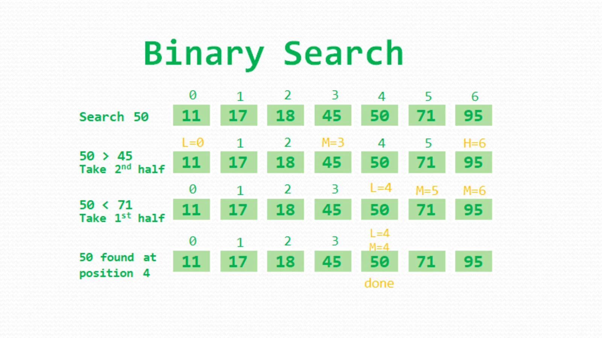
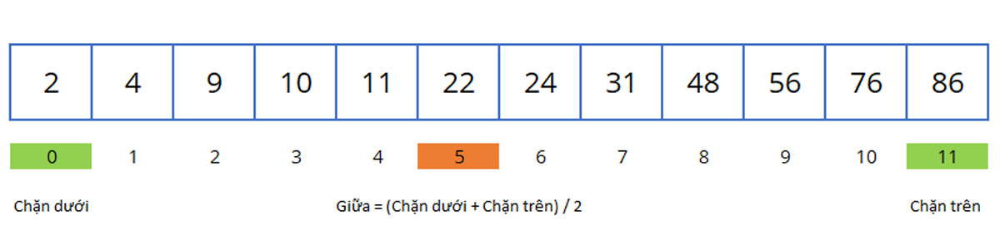
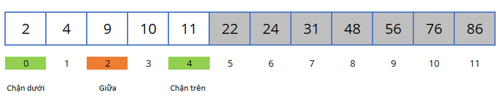

# Binary Search

### 1. Thuật toán Binary Search là gì ?


Thuật toán Binary Serach (Tìm kiếm nhị phân) là một thuật toán tìm kiếm tuyến tính cao cấp với thời gian chạy là **O(logN)**.

Đối với các danh sách lớn, thuật toán này tốt hơn hẳn tìm kiếm tuyến tính, nhưng nó đòi hỏi danh sách phải được sắp xếp từ trước và đòi hỏi khả năng truy nhập ngẫu nhiên (random access).

Thuật toán tìm kiếm nhị phân thường dùng để ***tìm kiếm phần tử trong một danh sách đã được sắp xếp***, ví dụ như trong một danh bạ điện thoại sắp xếp theo tên, có thể tìm kiếm số điện thoại của một người theo tên người đó.

Thuật toán tìm kiếm nhị phân chạy nhanh hơn tìm kiếm tuần tự nhưng cũng có một số nhược điểm ví dụ như **chậm hơn bảng băm**.

Nếu nội dung danh sách bị thay đổi thì danh sách phải được sắp xếp lại trước khi sử dụng tìm kiếm nhị phân. Tuy nhiên thao tác này thường tốn nhiều thời gian.

### 2. Ý tưởng và Mô tả thuật toán Binary Search
Vì thuật toán Binary Search yêu cầu mảng đã được sắp xếp. Thế nên, đầu vào của chúng ta là một mảng đã được sắp xếp.

Do đó, thuật toán tìm kiếm nhị phân sẽ so sánh giá trị đích với phần tử ở giữa của mảng (mảng được chia mảng ra làm 2 phần bên trái và bên phải phần tử đó)

Nếu chúng không bằng nhau thì dĩ nhiên một nửa không chứa mục tiêu sẽ bị bỏ đi.

Và việc tìm kiếm tiếp tục ở nửa còn lại, một lần nữa lấy phần tử ở giữa được chọn để so sánh với giá trị đích và lặp lại điều này cho đến khi tìm thấy giá trị đích.

Nếu tìm kiếm kết thúc với nửa còn lại trống, mục tiêu không nằm trong mảng.

Mặc dù ý tưởng rất đơn giản, nhưng việc thực hiện tìm kiếm nhị phân chính xác đòi hỏi phải chú ý đến một số điểm tinh tế về điều kiện thoát và tính toán điểm giữa của nó.

**Về cơ bản, các bước thực hiện tìm kiếm nhị x trong mảng như sau:**
<ol>
    <li>So sánh x với phần tử ở giữa</li>
    <li>Nếu x khớp với phần tử ở giữa, chúng ta trả về chỉ số giữa</li>
    <li>Nếu x lớn hơn phần tử giữa, thì x chỉ có thể nằm trong nửa phân đoạn bên phải sau phần tử mid. Vì vậy, chúng ta chỉ tìm kiếm ở nữa phải của mảng</li>
    <li>Nếu x nhỏ hơn phần tử giữa tiếp tục tìm ở nửa bên trái</li>
    <li>Lặp lại đến khi tìm ra x hoặc trả về null khi x không nằm trong mảng</li>
</ol>


```
Ví dụ:
- Cho 1 mảng arr = [2, 4, 9, 10, 11, 22, 24, 31, 48, 56, 76, 86]
- Tìm kiếm số 10 trong mảng arr
```
> Bước 1: ta so sánh số 10 với phần tử ở giữa thì thấy 10 < 22. Nên ta loại bỏ phần bên phải.


> Bước 2: Tiếp tục với phần bên trái với phần tử giữa là 9. Ta có 10 > 9. Vì thế ta loại bỏ phần bên trái.


> Bước 3: Tiếp tục với phần bên phải. So sánh phần tử ở giữa (với Giữa = (Chặn dưới + Chặn trên) / 2). Ta tìm thấy giá trị 10 ở vị trí 3.

