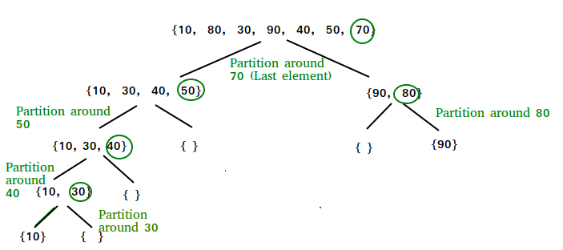

# Quick Sort

### 1. Thuật toán Quick Sort là gì?
Thuật toán Quick Sort là một thuật toán sắp xếp, còn được gọi là sắp xếp kiểu phân chia (Part Sort). Là một thuật toán hiệu quả dựa trên việc phân chia mảng dữ liệu thành các nhóm phần tử nhỏ hơn.
```
Phân loại: Giải thuật sắp xếp
Phức tạp thời gian: Trung bình O(n log n)
Xấu nhất: O(n2)
Phức tạp dữ liệu: Khác nhau tùy vào cách hiện thực
Tối ưu: Thỉnh thoảng
```
Giải thuật sắp xếp nhanh chia mảng thành hai phần bằng cách so sánh từng phần tử của mảng với một phần tử được gọi là phần tử chốt. Một mảng bao gồm các phần tử nhỏ hơn hoặc bằng phần tử chốt và một mảng gồm các phần tử lớn hơn phần tử chốt.

Quá trình phân chia này diễn ra cho đến khi độ dài của các mảng con đều bằng 1. Với phương pháp đệ quy ta có thể sắp xếp nhanh các mảng con sau khi kết thúc chương trình ta được một mảng đã sắp xếp hoàn chỉnh.


### 2. Kỹ thuật chọn phần tử chốt
Kỹ thuật chọn phần tử chốt ảnh hưởng khá nhiều đến khả năng rơi vào các vòng lặp vô hạn đối với các trường hợp đặc biệt. Tốt nhất chọn phần tử chốt nằm ở trung vị của danh sách. Khi đó, sau log2(n) lần chia ta đạt được kích thưởng mảng con bằng 1.

***Dưới đây là một số cách chọn phần tử chốt:***

- Chọn phần tử đứng đầu hoặc đứng cuối làm phần tử chốt.
- Chọn phần tử đứng giữa danh sách làm phần tử chốt.
- Chọn phần tử trung vị trong ba phần tử đứng đầu, đứng giữa và đứng cuối làm phần tử chốt.
- Chọn phần tử ngẫu nhiên làm phần tử chốt. Tuy nhiên cách này rất dễ dẫn đến khả năng rơi vào các trường hợp đặc biệt.


### 3. Ý tưởng thuật toán Quick Sort


***Các bước thực hiện***
<ol>
<li>Chọn phần tử chốt.</li>
<li>Khai báo 2 biến con trỏ để trỏ để duyệt 2 phía của phần tử chốt.</li>
<li>Biến bên trái trỏ đến từng phần tử mảng con bên trái của phần tử chốt.</li>
<li>Biến bên phải trỏ đến từng phần tử mảng con bên phải của phần tử chốt.</li>
<li>Khi biến bên trái nhỏ hơn phần tử chốt thì di chuyển sang phải.</li>
<li>Khi biến bên phải nhỏ hơn phần tử chốt thì di chuyển sang trái.</li>
<li>Nếu không xảy ra trưởng hợp 5 và 6 thì tráo đổi giá trị 2 biến trái và phải.</li>
<li>Nếu trái lớn hơn phải thì đây là giá trị chốt mới.</li>
</ol>


### 4. Ưu và nhược điểm của thuật toán Quick sort

Thuật toán Quick sort chạy rất nhanh nhưng nó cũng có nhược điểm đó là: ___Không hiệu quả trên những dãy đã được sắp xếp sẵn___.

Khi đó ta phải mất N lần gọi đệ quy và mỗi lần chỉ loại được 1 phần tử.

Thời gian thực hiện thuật toán trong trường hợp xấu nhất này là **O(n2)**.

Trong trường hợp tốt nhất, mỗi lần phân chia sẽ được 2 nửa dãy bằng nhau, khi đó thời gian thực hiện thuật toán là: **T(N) = 2T(N/2) + N**

Khi đó **T(N)** xấp xỉ bằng **NlogN**.

Như vậy Quick sort là thuật toán hiệu quả trong đa số các trường hợp. Nhưng đối với các trường hợp việc sắp xếp chỉ phải thực hiện ít và lượng dữ liệu lớn thì chúng ta nên sử dụng một số thuật toán khác.