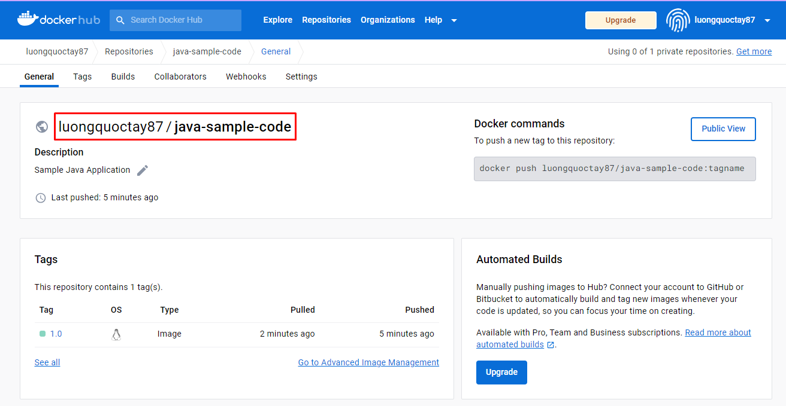

# Dockerized application using Jib

### 1. Preparing the Deployment

Provide DockerHub credentials to `.m2/settings.xml`
```
<?xml version="1.0" encoding="UTF-8"?>
<settings xmlns="http://maven.apache.org/SETTINGS/1.2.0"
          xmlns:xsi="http://www.w3.org/2001/XMLSchema-instance"
          xsi:schemaLocation="http://maven.apache.org/SETTINGS/1.2.0 https://maven.apache.org/xsd/settings-1.2.0.xsd">
    <pluginGroups></pluginGroups>
    <proxies></proxies>
    <servers>
        <server>
            <id>registry.hub.docker.com</id>
            <username><DockerHub Username></username>
            <password><DockerHub Password></password>
        </server>
    </servers>
    <mirrors>
    </mirrors>
    <profiles></profiles>
</settings>
```

Delete the `credsStore` property from the `.docker/config.json` file
```
{
  "auths": {
    "https://index.docker.io/v1/": {}
  },
  "credsStore": "desktop"
}
```

The file will now contain the following
```
{
  "auths": {
    "https://index.docker.io/v1/": {}
  }
}
```

### 2. Simplifying the Maven Command

- pom.xml
```
<properties>
    <image.path>registry.hub.docker.com/luongquoctay87</image.path>
</properties>
...
<plugin>
    <groupId>com.google.cloud.tools</groupId>
    <artifactId>jib-maven-plugin</artifactId>
    <version>2.8.0</version>
    <configuration>
        <from>
            <image>openjdk:17</image>
        </from>
        <to>
            <image>${image.path}/${project.artifactId}:${project.version}</image>
        </to>
    </configuration>
</plugin>
```

- Create repository `java-sample-code` on DockerHub



### 3. Deploying to Docker Hub With Jib
- syntax:
```
- $ mvn package -P <profile-id> jib:build
```

- Simplify with maven command
```
- $ mvn package -P dev jib:build
```


---
***Source code:*** [GitHub](https://github.com/luongquoctay87/java-sample-code/tree/main)

***Reference sources:*** [Dockerizing Java Apps using Jib](https://www.baeldung.com/jib-dockerizing)
