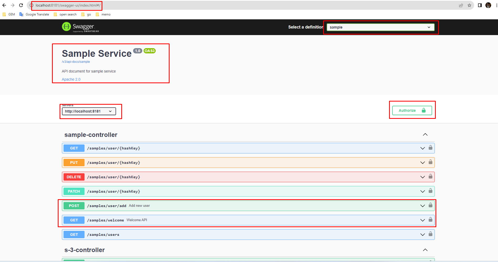

## API Document with OpenAPI

### 1. Add dependency
```
<dependency>
    <groupId>org.springdoc</groupId>
    <artifactId>springdoc-openapi-ui</artifactId>
    <version>1.6.11</version>
</dependency>
```

### 2. Add .yml file
- application.yml
```
spring:
  mvc:
    pathmatch:
      matching-strategy: ant_path_matcher
```
- application-dev.yml
```
springdoc:
  api-docs:
    enabled: true
  swagger-ui:
    enabled: true

openapi:
  service:
    api-docs: sample
    server: http://localhost:8181
    title: Sample Service
    version: 1.0
```

- application-test.yml
```
springdoc:
  api-docs:
    enabled: true
  swagger-ui:
    enabled: true

openapi:
  service:
    api-docs: sample
    server: http://localhost:8181
    title: Sample Service
    version: 1.0
```

- application-prod.yml
```
springdoc:
  api-docs:
    enabled: false
  swagger-ui:
    enabled: false
```

### 3. Add Configuration
```
@Configuration
public class SpringFoxConfig {
    @Bean
    public GroupedOpenApi publicApi(@Value("${openapi.service.api-docs}") String apiDocs) {
        return GroupedOpenApi.builder()
                .group(apiDocs) // /v3/api-docs/sample
                .packagesToScan("com.sample.controller")
                .build();
    }

    @Bean
    public OpenAPI openAPI(
            @Value("${openapi.service.title}") String title,
            @Value("${openapi.service.version}") String version,
            @Value("${openapi.service.server}") String serverUrl) {
        final String securitySchemeName = "bearerAuth";
        return new OpenAPI()
                .servers(List.of(new Server().url(serverUrl)))
                .components(
                        new Components()
                                .addSecuritySchemes(
                                        securitySchemeName,
                                        new SecurityScheme()
                                                .type(SecurityScheme.Type.HTTP)
                                                .scheme("bearer")
                                                .bearerFormat("JWT")))
                .security(List.of(new SecurityRequirement().addList(securitySchemeName)))
                .info(new Info().title(title)
                        .description("API document for sample service")
                        .version(version)
                        .license(new License().name("Apache 2.0").url("http://springdoc.org")));
    }

}
```

### 4. Implement to controller
```
@RestController
@RequestMapping("/samples")
@Slf4j(topic = "SAMPLE-CONTROLLER")
public record SampleController(SampleUserService userService) {
    ...
    @Operation(description = "Welcome API", summary = "Return message")
    @GetMapping(path = "/welcome", headers = apiKey)
    public String welcome() {
        return Translator.toLocale("message.welcome");
    }

    @Operation(description = "Add new user", summary = "Return user ID")
    @PostMapping(path = "/user/add", headers = apiKey)
    public SuccessResponse createSampleUser(@Validated @RequestBody SampleUserRequest request) {
        log.info("Request POST /user/add");
        ...
    }
    ...
}
```

### 5. Run swagger ui
- Access: http://localhost:8181/swagger-ui.html




- ***Reference sources:***
    - [Documenting a Spring REST API Using OpenAPI 3.0](https://www.baeldung.com/spring-rest-openapi-documentation)
    - [Swagger(OpenAPI Specification 3) Integration with Spring Cloud Gateway — Part 2](https://medium.com/@pubuduc.14/swagger-openapi-specification-3-integration-with-spring-cloud-gateway-part-2-1d670d4ab69a)
    - [Central Swagger in Spring Cloud Gateway.](https://medium.com/@oguz.topal/central-swagger-in-spring-cloud-gateway-697a1c37b03d)