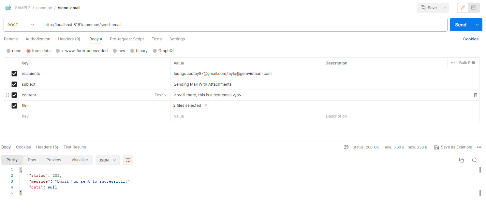

# Sending Emails by AWS SES

### 1. Add dependency
```
<dependency>
    <groupId>org.springframework.boot</groupId>
    <artifactId>spring-boot-starter-mail</artifactId>
</dependency>
```

### 2. AWS SES Configuration in `application.properties`
```
spring.mail.host=email-smtp.eu-west-1.amazonaws.com
spring.mail.username=${YOUR_SMTP_USERNAME}
spring.mail.password=${YOUR_SMTP_PASSWORD}
spring.mail.properties.mail.transport.protocol=smtp
spring.mail.properties.mail.smtp.port=587
spring.mail.properties.mail.smtp.auth=true
spring.mail.properties.mail.smtp.starttls.enable=true
spring.mail.properties.mail.smtp.starttls.required=true
from.email.address=${YOUR_EMAIL_ADDRESS}
```

### 3. Create MailService
```
@Service
@Slf4j(topic = "MAIL-SERVICE")
public class MailService {

    @Value("${from.email.address}")
    private String fromEmailAddress;

    @Autowired
    private JavaMailSender mailSender;

    public void sendEmail(String recipients, String subject, String content, MultipartFile[] files) throws UnsupportedEncodingException, MessagingException {
        log.info("Email is sending ...");

        MimeMessage message = mailSender.createMimeMessage();
        MimeMessageHelper helper = new MimeMessageHelper(message, true, CharEncoding.UTF_8);
        helper.setFrom(fromEmailAddress, "John Doe");

        if (recipients.contains(",")) { // send to multiple users
            helper.setTo(InternetAddress.parse(recipients));
        } else { // send to single user
            helper.setTo(recipients);
        }

        // Send attach files
        if (files != null) {
            for (MultipartFile file : files) {
                helper.addAttachment(Objects.requireNonNull(file.getOriginalFilename()), file);
            }
        }

        helper.setSubject(subject);
        helper.setText(content, true);
        mailSender.send(message);

        log.info("Email has sent to successfully, recipients={}", recipients);
    }
}

```

### 4. Create API `/send-email`
```
@RestController
@RequestMapping("/common")
@Slf4j(topic = "COMMON-CONTROLLER")
public record CommonController(CommonService commonService, MailService mailService) {
    ...
    @PostMapping("/send-email")
    public SuccessResponse sendEmail(@RequestParam String recipients, @RequestParam String subject,
                                        @RequestParam String content, @RequestParam(required = false) MultipartFile[] files) {
        log.info("Request GET /common/send-email");
        try {
            mailService.sendEmail(recipients, subject, content, files);
            return new SuccessResponse(ACCEPTED, "Email has sent to successfully");
        } catch (UnsupportedEncodingException | MessagingException e) {
            log.error("Sending email was failure, message={}", e.getMessage(), e);
            return new FailureResponse(BAD_REQUEST, "Sending email was failure");
        }
    }
    ...
}
```

### 5. Test API `/send-email` by Postman

