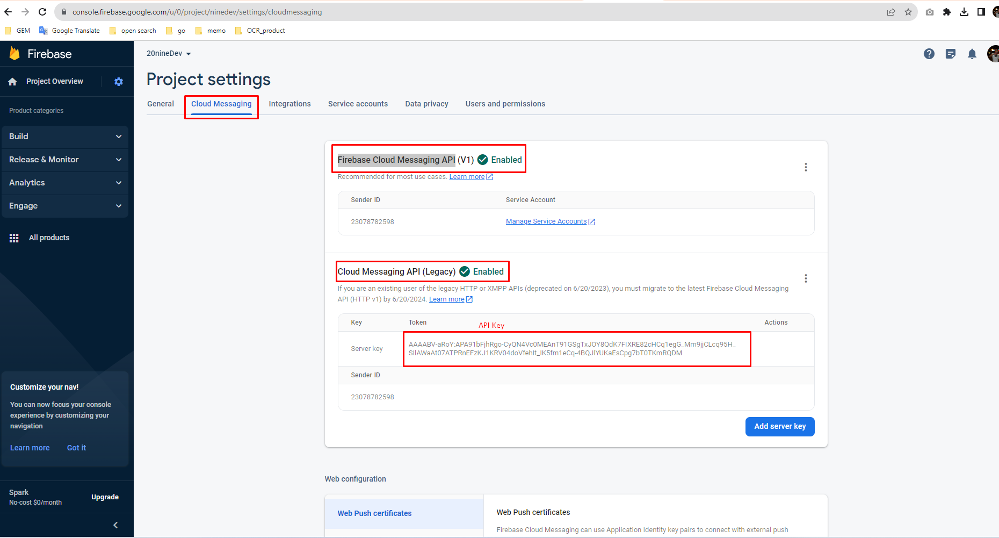
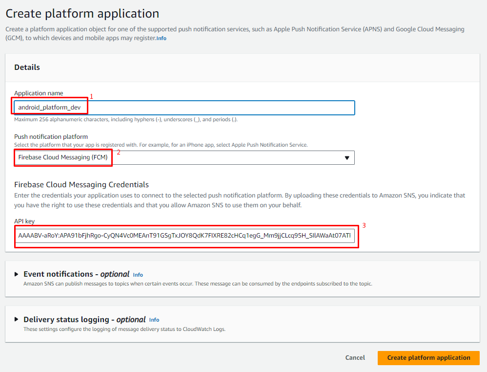
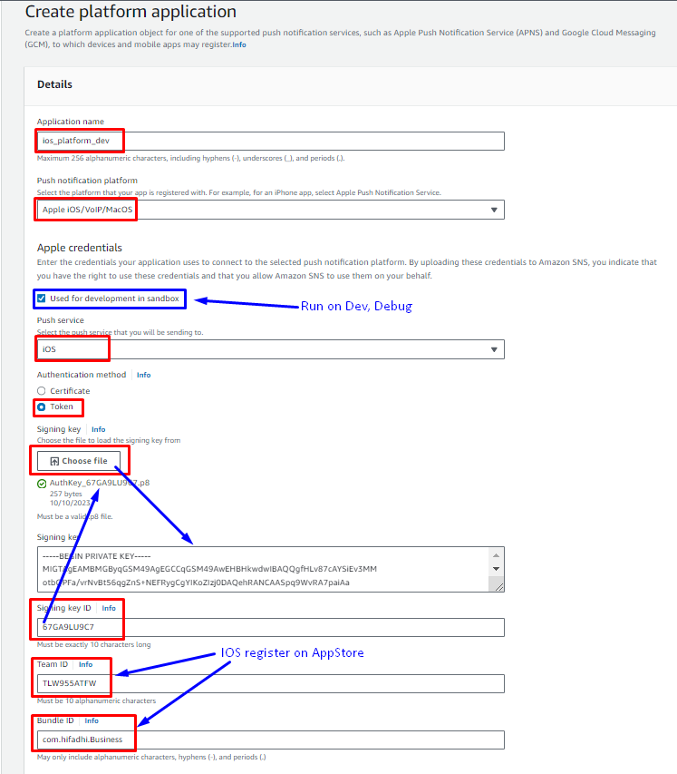
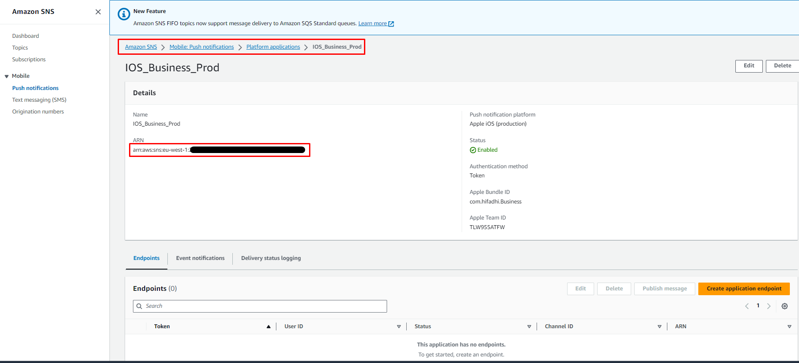

## Working With Simple Notification Service

### 1. Create platform application on AWS
- Access [Push notifications](https://eu-west-1.console.aws.amazon.com/sns/v3/home?region=eu-west-1#/mobile/push-notifications/platform-applications) > [Create platform application](https://eu-west-1.console.aws.amazon.com/sns/v3/home?region=eu-west-1#/mobile/push-notifications/platform-applications)


#### 1.1 Create platform android application

- Register firebase on Google:

    [Google Console](https://console.firebase.google.com/) -> Create Project -> Cloud Message -> Enable Firebase Cloud Messaging API

    

    - Add API key to SNS
    
    

    ---

#### 1.2 Create platform IOS application




### 2. Integrate AmazonSNSClient to Spring Boot

#### 2.1 Add dependency
```
<dependency>
    <groupId>com.amazonaws</groupId>
    <artifactId>aws-java-sdk-sns</artifactId>
    <version>1.12.472</version>
</dependency>
```

#### 2.2 Config AmazonSNS
- Update application-*.yml
```
amazon:
    sns:
        region: ${AMAZON_SNS_REGION}
        accessKey: ${AMAZON_SNS_ACCESS_KEY}
        secretKey: ${AMAZON_SNS_SECRET_KEY}
```

- Create file `AmazonSNSConfig`
```
@Configuration
public class AmazonSNSConfig {
    @Value("${amazon.sns.region}")
    private String awsRegion;

    @Value("${amazon.sns.accessKey}")
    private String awsAccessKey;

    @Value("${amazon.sns.secretKey}")
    private String awsSecretKey;

    @Bean
    public AmazonSNSClient amazonSNSClient() {
        return (AmazonSNSClient) AmazonSNSClientBuilder.standard().withRegion(Regions.fromName(awsRegion))
                .withCredentials(new AWSStaticCredentialsProvider(new BasicAWSCredentials(awsAccessKey, awsSecretKey)))
                .build();
    }
}
```

#### 2.3 Implement send message to SNS
```
@Slf4j(topic = "SNS-CLIENT")
@Service
public class SNSClient {
    @Autowired
    private AmazonSNSClient snsClient;

    public void sendToSNS(String platformArn, String deviceToken, String message) {
        log.info("Start send SNS message");

        CreatePlatformEndpointRequest createPlatformEndpointRequest = new CreatePlatformEndpointRequest()
                .withPlatformApplicationArn(platformArn)
                .withToken(deviceToken);
        CreatePlatformEndpointResult result = snsClient.createPlatformEndpoint(createPlatformEndpointRequest);
        log.info("Endpoint ARN: {}", result.getEndpointArn());
        try {
            PublishRequest publishRequest = new PublishRequest()
                    .withMessageStructure("json")
                    .withTargetArn(result.getEndpointArn())
                    .withMessage(message);
            PublishResult publishResponse = snsClient.publish(publishRequest);
            log.info("End send SNS message");
        } catch (Exception e) {
            log.error(e.getMessage(), e);
        } finally {
            // Create the delete request
            DeleteEndpointRequest deleteEndpointRequest = new DeleteEndpointRequest()
                    .withEndpointArn(result.getEndpointArn());
            // Delete the platformArn endpoint
            DeleteEndpointResult deleteEndpointResult = snsClient.deleteEndpoint(deleteEndpointRequest);
            log.info("Endpoint deleted: {}", result.getEndpointArn());
        }
    }
}
```

#### 2.4 Create API

- Create request form
```
@Data
public class MobileSignUpRequest implements Serializable {

    @NotBlank(message = "{msg-validate-phone}")
    private String phone;

    @NotBlank(message = "{msg-validate-password}")
    private String password;

    @NotBlank(message = "deviceToken must be not blank")
    private String deviceToken;
}
```

- Create controller

```

@RestController
@RequestMapping("/signUp")
public record SignUpController(SampleUserService userService, SNSClient snsClient) {

    @Operation(summary = "Sign up from mobile", description = "Return user ID and push notify")
    @PostMapping("/mobile")
    public String mobileSignUp(@Validated @RequestBody MobileSignUpRequest request) {
        String result = userService.saveSampleUser(request);

        String platformArn = "arn:aws:sns:eu-west-1:xxxx"; // Get ARN from amazon SNS platform
        String message = "Welcome to SNS";
        snsClient.sendToSNS(platformArn, request.getDeviceToken(), message);

        return result;
    }

}
```

***Note: Platform ARN information***




### 3. Test SNS
```
curl -X 'POST' \
  'http://localhost:8181/signUp/mobile' \
  -H 'accept: */*' \
  -H 'Content-Type: application/json' \
  -d '{
  "phone": "0123456789",
  "password": "password",
  "deviceToken": "xxx"
}'
```

> __Cautions: It's only run on real token on real device__
